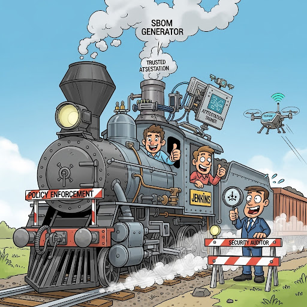

= Red Hat Developer Hub + Red Hat Advanced Developer Suite Demo Guide
:author: Sales Engineer / Developer Advocate
:revdate: 2025-07-02
:icons: font
:toc:
:toclevels: 1

== Scenario

In this demo, you will walk your audience through what it looks like for a developer at ACME Corp to:

* Create a new Quarkus application using a software template in Red Hat Developer Hub (RHDH)
* Automatically integrate the application build with secure CI/CD pipelines powered by Jenkins and Red Hat Advanced Developer Suite (ADS)
* Store source code in GitLab and container images in Quay
* Leverage automation, security policies, and developer self-service in one streamlined flow

The goal is to demonstrate how platform engineering teams can enable developer velocity without compromising on security or governance.

== Part 1 — Introduce the Context

Start by explaining the typical challenges:

* Developers want to move fast and focus on writing code.
* Setting up CI/CD, webhooks, GitOps, and security validations takes time and often falls on DevOps teams.
* ACME's platform team uses Red Hat Developer Hub to make this easier — enabling self-service scaffolding of applications with pre-integrated pipelines, Git repositories, and policy enforcement.

This demo complements the previous one which used OpenShift Pipelines (Tekton) for CI/CD. While Tekton is cloud-native and fully integrated into OpenShift, many of our enterprise customers — including ACME — still rely on Jenkins due to existing investments and plugins.

By showcasing the Jenkins path, you’re addressing a common real-world scenario: modernizing CI/CD workflows without needing to abandon proven Jenkins-based processes.

Explain how this approach:

* Reduces DevOps bottlenecks
* Enforces consistent patterns across services
* Provides governance and automation by default
* Supports teams where Jenkins remains the standard CI/CD tool

== Part 2 — Scaffold a New Application in Red Hat Developer Hub

. Navigate to {rhdh_url}[Red Hat Developer Hub^] and click *Sign In* on the OIDC prompt.
. Enter your *Username or email*: `{rhdh_user}` and *Password*: `{rhdh_user_password}`.
. In the top-right corner, click the *+* button to start creating a new software component.
. Choose the template: _Securing a Quarkus Service Software Supply Chain (Jenkins)_.

. Accept the default values unless customization is needed. The template collects basic metadata like app name, registry info, and repository setup.

Fields like the following are preconfigured:

.Application Info
|===
| Field | Example Value

| Name | `my-quarkus-jnk`
| Group Id | `redhat.rhdh`
| Artifact Id | `my-quarkus-jnk`
| Java Package Name | `org.redhat.rhdh`
| Description | `A cool Quarkus app`
|===

.Image Registry Info
|===
| Field | Example Value

| Image Registry | `Quay`
| Organization | `tssc`
|===

.Repository Info
|===
| Field | Example Value

| Source Repo | `GitLab`
| Repo Owner | `development`
| Verify Commits | `enabled`
|===

. Click *Review* to verify your inputs, then click *Create* to generate the new application.

[TIP]
====
As the presenter, explain that this step does more than just generate code — it also sets up:

- A fully initialized GitLab repository with source and GitOps manifests
- A signed commit flow if "Verify Commits" is enabled
- CI/CD pipeline integration using Jenkins
- Component registration inside Developer Hub for visibility
====

[NOTE]
====
The `Verify Commits` option enables signing and verification of Git commits using `gitsign`, which integrates with Red Hat’s Trusted Software Supply Chain.
====
---

== Part 3 — What Happens Behind the Scenes

Behind the scenes, Red Hat Developer Hub and the ADS template do the heavy lifting:

* Creates both the **source code** and **GitOps** repositories using information from the template.
* Configures **GitLab webhooks** to trigger Jenkins pipelines on push events.
* Commits **pipeline configuration**, including Jenkinsfiles and Kubernetes manifests.
* Registers the component in the **Developer Hub catalog**, enabling traceability and lifecycle management.
* Automatically triggers the initial CI/CD build if *Verify Commits* is disabled (for demo convenience).

[TIP]
====
Let your audience know:

_"The developer doesn’t have to manually wire any of this. Developer Hub handles everything — Git setup, CI/CD triggers, pipeline configs, and deployment — all in a few clicks."_
====

[NOTE]
====
For customers already using Jenkins, this template shows how ADS can plug into their existing tools while still enforcing secure supply chain policies.
====

== Part 4 — Make a Code Change in DevSpaces

Once the application has been created and registered in the Developer Hub:

. Navigate to the *Catalog* and find your new component (`my-quarkus-jnk`).
. Click on the component name to open the *Overview* page.
. Locate the *OpenShift Dev Spaces* link and click on it — this launches a Red Hat OpenShift Dev Spaces environment preloaded with your project.
. If redirected to the *Red Hat OpenShift* login page, click *Log In with OpenShift* and use the credentials:  
  Username: `{rhdh_user}`  
  Password: `{rhdh_user_password}`
. If prompted, click *Allow selected permissions* on the *Authorize Access* page.
. Click *Continue* on the *Do you trust the authors of this repository?* popup.
. On the *GitLab* authentication page, enter:  
  Username: `{gitlab_user}`  
  Password: `{gitlab_user_password}`  
  and click *Sign in*.
. Click *Authorize devspaces* on the next window.
. Wait for the workspace to fully start.
. If prompted, trust all workspaces and authors.

=== Make a Code Change

. In the DevSpaces IDE, open the file:  
  `my-quarkus-jnk/docs/index.md`
. Add a small change to the file — for example, append a new line of text.

=== Open the Terminal

Open the integrated terminal:

From the top menu bar, click on *Terminal → New Terminal*

This will open a terminal panel at the bottom of the IDE, with your project directory pre-selected.

=== Commit and Push the Change

. Stage your changes:

[source,shell]
----
git add .
----

. Commit your changes:

[source,shell]
----
git commit -m "Update"
----

During this step, `gitsign` will intercept the commit and initiate the signing process. The terminal will display a URL and prompt you to open it in your browser.

. Click the URL to open a browser window and authorize the signing request.
. A verification code will appear in the browser.
. Copy the verification code and return to the terminal.
. Paste the code into the terminal to complete the commit signing process.  
  If prompted, ensure you allow paste functionality.

. Finally, push your changes to GitLab:

[source,shell]
----
git push
----

This push will trigger the CI/CD pipeline via the GitLab webhook.

[NOTE]
====
If *Verify Commits* was enabled when creating the template, a signed commit is required to trigger the pipeline.
====

== Part 5 — Show the Build Pipeline (Jenkins)

In *Developer Hub*, navigate to the *CI* tab of the `my-quarkus-jnk` component.  
You should see three pipeline runs:

- `maven-ci-build`
- `promote-to-stage`
- `promote-to-prod`

The pipeline `maven-ci-build` should be running. Click on *View build* to open Jenkins.

Then click *Open Blue Ocean* to walk through the Jenkins pipeline visually.

== Part 6 - Pipeline Tasks

As the Jenkins pipeline runs, guide your audience through the following key stages.  
Each task showcases part of the secure software supply chain process.

=== Stage: `verify-commit` (conditional)

Say:
> "This step verifies the developer’s Git commit signature."

Do:
Click the `verify-commit` stage.

Explain:
- This uses `gitsign`, which integrates with the RHTAS service to verify that the commit was signed and came from a trusted user.
- This stage only runs if the *Verify Commits* option was enabled in the template.

=== Stage: `mvn package`

Say:
> "Now we compile and package the application."

Do:
Click the `mvn package` stage.

Explain:
- Runs a Maven build to compile the Quarkus Java application.
- Produces the runnable JAR.

=== Stage: `init`

Say:
> "Next, we set up the build environment."

Do:
Click the `init` stage.

Explain:
- This stage initializes environment variables (like timestamps, image URLs).
- It prepares Jenkins using the shared `rhtap` library to standardize the process.

=== Stage: `build`

Say:
> "Let’s now build and sign the container image."

Do:
Click the `build` stage.

Explain:
- Uses `buildah` to create the container image.
- Uses `cosign` to sign the image and add attestations — ensuring provenance and integrity.

=== Stage: `deploy-and-upload-to-tpa` (parallel)

Say:
> "This part handles GitOps updates and SBOM uploads."

Do:
Expand the `deploy-and-upload-to-tpa` stage.

Explain:
- **deploy**: Updates the GitOps repo with the new image tag — triggering redeployment to dev via Argo CD.
- **upload_sbom_to_trustification**: Uploads the generated SBOM to Red Hat Trusted Profile Analyzer (TPA) for scanning.

You can open TPA at `{tpa_url}`  
Login: `{tpa_user}` / `{tpa_user_password}`  
Click on *SBOMs* in the left menu to view results.

=== Stage: `acs` (parallel)

Say:
> "Next is policy enforcement and vulnerability scanning."

Do:
Expand the `acs` stage.

Explain:
- **acs_deploy_check**: Checks for security compliance in your Kubernetes deployment (e.g., RBAC, network).
- **acs_image_check**: Runs policy checks on the container image.
- **acs_image_scan**: Triggers a vulnerability scan using Red Hat Advanced Cluster Security.

To explore results:
Visit `{acs_url}`  
Login with `{acs_admin_user}` / `{acs_admin_password}`

=== Stage: `summary`

Say:
> "Finally, we summarize the results."

Do:
Click on the `summary` stage.

Explain:
- This displays the generated SBOM and an overall summary of the build.
- This is generated using the shared `rhtap` library functions.

=== Pipelines as Code

Say:
> "Let’s take a quick look at why we define our Jenkins pipeline right inside the same Git repo as our application code. This is what we call *Pipelines as Code*."

Do:
Open the `my-quarkus-jnk` repository in GitLab and point to the `Jenkinsfile` at the root of the repo.

Explain:

This `Jenkinsfile` defines how our app gets built, tested, signed, and deployed. Because it's versioned with the service code, the pipeline always matches the app — no outdated logic or missing steps.

==== Benefits for Developers:
- You don’t need to request a new pipeline or wait for a central team to configure it.
- You can update the pipeline the same way you update code — using a pull request.
- Everything is visible, traceable, and easy to collaborate on.

==== Benefits for ACME (platform and security teams):
- Define pipeline logic once using shared libraries like `rhtap`, then reuse it across teams.
- Apply security policies consistently at every stage of CI/CD — without manual steps.
- Every pipeline change is auditable and version-controlled, just like application code.

In short: *Pipelines as Code* brings security, agility, and transparency — helping teams move faster without losing control.

== Part 7 — Summary

Summarize what happened during the demo:

* The developer scaffolded a new Quarkus service using Red Hat Developer Hub
* A secure CI/CD pipeline using Jenkins was automatically configured and triggered
* Commits were signed using gitsign and verified via RHTAS
* Container images were built, signed, scanned, and attested with Cosign, TPA, and ACS
* The service was deployed to development via GitOps — with no manual intervention

== Part 8 — Wrap-Up

Summarize again to reinforce the end-to-end flow:

* Developer created a service in minutes using Developer Hub
* CI/CD pipelines came pre-wired with Jenkins and advanced security integrations
* Commits and container images were cryptographically signed, vulnerability scanned, and policy validated
* GitOps deployment was triggered automatically, completing the promotion

=== Key Takeaways

* *Secure-by-default delivery* — Every change is signed, validated, and scanned automatically
* *Streamlined developer onboarding* — Developers can go from idea to deployment in minutes
* *Governance through automation* — Policy enforcement is built into the process — not bolted on
* *Platform team enablement* — Templates and shared pipelines make it easy to scale best practices
* *Transparency and traceability* — Every step in the lifecycle is logged, auditable, and versioned
* *End-to-end toolchain integration* — GitLab, Quay, Jenkins, and ACS work together out of the box

=== Optional Enhancements

* *Explore the Developer Hub Catalog entry* for the new software component  
  → Highlight metadata such as links to GitLab, pipeline run history, Quay image repository, and RHACS (Advanced Cluster Security) scan results.

* *Show integration depth*  
  → Follow the commit link from Developer Hub to the corresponding GitLab commit.  
  → Open the Jenkins job from the Developer Hub CI tab and view build logs, Blue Ocean pipeline stages, and generated artifacts.

* *Demonstrate template flexibility*  
  → Point out that teams can easily adapt the existing software template to other tech stacks such as Python, Node.js, or Spring Boot.  
  → This approach enables consistent security and deployment practices across diverse applications.

* *Mention collaboration opportunities*  
  → Platform engineers, AppDev leads, and InfoSec teams can co-author templates, enforce common policies, and accelerate delivery while maintaining governance.
